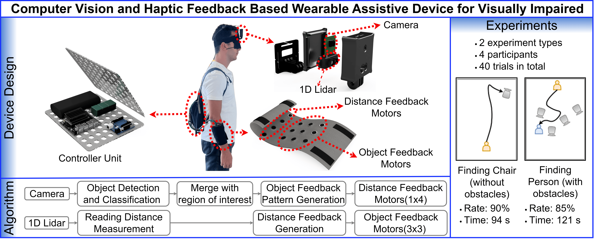

# Vis-Assist: Computer Vision and Haptic Feedback Based Wearable Assistive Device for Visually Impaired

> 📰 This project is based on the paper published in *Journal of Multimodal User Interfaces (JMUI)*:  
> [Vis-Assist: A Wearable Visual Assistive System with Haptic Feedback for Object Detection and Localization](https://link.springer.com/article/10.1007/s12193-025-00452-5)



**Vis-Assist** is a low-cost, wearable visual assistive device designed to enhance the daily mobility and safety of visually impaired individuals. It integrates object detection, distance estimation, and real-time **haptic feedback** using a compact, self-contained computational unit — eliminating the need for external servers.

Unlike traditional audio-based systems, Vis-Assist communicates object information via a **vibration motor array**, enabling users to identify the type and location of 19 distinct object classes without obstructing their hearing. This feedback system requires only a brief training period and functions seamlessly in complex indoor environments.

## ✨ Key Features

- Real-time object detection and classification
- Distance estimation to nearby obstacles
- Haptic feedback through a wearable vibration motor array
- Fully standalone operation (no internet/server required)
- Capable of guiding users in open spaces and around obstacles

## 🚀 Installation

To set up the environment for Vis-Assist on Jetson devices, follow these steps:

1. **Create and activate a Python virtual environment:**

```
python3 -m venv visassist-env
source visassist-env/bin/activate
```

2. **Upgrade pip and install dependencies:**
```
pip install --upgrade pip
pip install -r requirements.txt
```
---

## 🔄 Patch Details

This project is based on [YOLOv7](https://github.com/WongKinYiu/yolov7), with custom modifications to support:

- Real-time haptic feedback using a vibration motor array
- Integration with TFmini Lidar sensor for distance measurement
- ROI-based object class detection and vibration triggering
- Support for GStreamer pipeline (Jetson Nano/Orin camera support)
- Annotated overlays for object name and distance

Only the changes are provided in the form of a unified `diff` patch to comply with licensing and to keep the original YOLOv7 codebase intact.

### 📁 Patch File

Download or view the patch file: [`vis-assist_yolov7_patch.diff`](./vis-assist_yolov7_patch.diff)

---

### 💡 How to Apply the Patch

```
git clone https://github.com/WongKinYiu/yolov7.git
cd yolov7
git checkout 072f76c72c641c7a1ee482e39f604f6f8ef7ee92
patch -p1 < ../yolov7_patch.diff
```
---

## 🔧 Usage

To run the Vis-Assist system and start real-time object detection with haptic feedback, use the following command:

```
python detect.py --weights yolov7-tiny.pt --conf 0.25 --img-size 640 --source <camera_path>
```
* weights: Path to the trained YOLOv7 model weights (e.g., yolov7.pt)

* conf: Confidence threshold for object detection (e.g., 0.25)

* img-size: Size of the input image (e.g., 640)

* source: Camera source path (e.g., /dev/video0 for USB camera or 0 for default webcam)

### Example Usage

```
python detect.py --weights yolov7-tiny.pt --conf 0.25 --img-size 640 --source 0

```
---

##  Motor Driver (Arduino UNO)

An **Arduino UNO** is used as a motor driver to provide haptic feedback via vibration motors. The Jetson Nano sends detected object class and distance information over UART, and the Arduino activates the motors accordingly.

The motor feedback includes:
- Object-specific tap patterns using digital pins
- Distance-based intensity control using PWM pins

To enable this functionality, upload the `Motor_Driver.ino` file (included in this repository) to your Arduino UNO.

The Arduino listens on serial (9600 baud) and responds automatically to messages from the Jetson system.

## 📊 Experimental Results

- Users located specific objects (e.g., chairs) in under **94 seconds** in a 40 m² empty area
- In obstacle-rich environments, average completion time remained under **121 seconds**
- Demonstrated potential to **reduce collisions** and improve navigation confidence

---

## 📜 License

This project is licensed under the [GNU General Public License v3.0 (GPLv3)](https://www.gnu.org/licenses/gpl-3.0.html), in accordance with the original YOLOv7 license.  
You are free to use, modify, and distribute the code under the same license terms.

---


## 🙏 Acknowledgements

I would like to express my sincere gratitude to my advisor **Assoc. Prof. Dr. Abdurrahman Gümüş** for his invaluable guidance and continuous support throughout this project. I also extend my thanks to the **Izmir Institute of Technology** for providing the resources and infrastructure necessary for the development and evaluation of this system.

The experimental evaluation of the system was conducted with the participation of **four volunteers**, to whom I am especially grateful for their time and valuable contributions. All experiments were carried out in accordance with ethical standards and were approved by the **Ethics Committee of Izmir Institute of Technology**.


---

## 📬 Contact

For questions or collaborations, please contact: [ibrahimdede@iyte.edu.tr]


